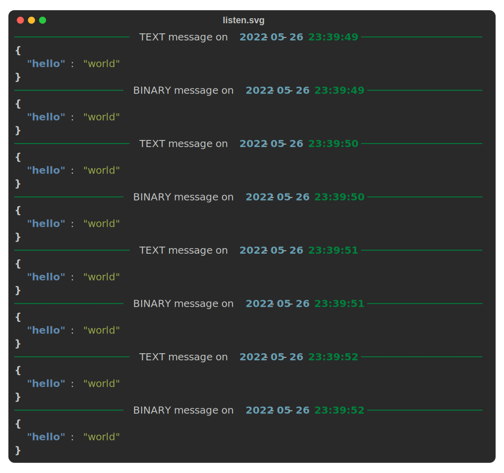

## listen

This command lets you sniff messages on a specific path of a websocket server.

```shell
ws listen -h
Usage: ws listen [OPTIONS] URL

  Listens messages on a given URL.

Options:
  -j, --json                  Pretty print json messages.
  -d, --duration FLOAT RANGE  Time to run the program in seconds.  [x>0]
  -f, --file FILE             File to store the output. The file extension
                              determines the type of file will be created. A
                              file ending with ".html" will be an html file, a
                              file ending with ".svg" will be an SVG file and
                              other extensions will be considered as text
                              files.
  -h, --help                  Show this message and exit.
```

### Example usage

For my examples, I will consider this little server script, but you can of course use you own server.

```python
import json

from trio_websocket import serve_websocket, WebSocketRequest, ConnectionClosed
import trio


async def handler(request: WebSocketRequest) -> None:
    ws = await request.accept()
    message = json.dumps({'hello': 'world'})
    while True:
        try:
            await ws.send_message(message)
            await ws.send_message(message.encode())
            await trio.sleep(1)
        except ConnectionClosed:
            break


async def main():
    await serve_websocket(handler, 'localhost', 8000, None)


trio.run(main)
```

In this basic example, we listen messages on `ws://localhost:8000/`. Note the shortcut notation for `localhost` endpoint.

```shell
$ ws listen :8000
# you will have an output like the following
──────────────────── TEXT message on 2022-05-25 07:10:07 ────────────────────────────────────
{"hello": "world"}
──────────────────── BINARY message on 2022-05-25 07:10:07 ──────────────────────────────────────
b'{"hello": "world"}'
```

!!! note
    To stop the program you can tap `Ctrl+C`. On linux/unix you can use the `SIGTERM` signal to stop the process.

Ok this first example works but if you know that the data you will receive in **json** format, you can use the `--json`
flag to pretty print it.

```shell
$ ws listen :8000 --json
──────────────────────────── TEXT message on 2022-05-25 07:11:27 ────────────────────────────────
{
  "hello": "world"
}
───────────────────────────── BINARY message on 2022-05-25 07:11:27 ─────────────────────────────────
{
  "hello": "world"
}
```

You can run the program for a specified time expressed in **seconds**. The following line will run the program for two
minutes.

```shell
$ ws listen :8000 -d 120
```

You can also save the terminal output in a file if you wish. There are three supported output formats:

- **html**: To save a file in html, the file you provide must end with the suffix `.html` like `file.html`.
- **svg**: To save a file in svg, the file you provide must end with the suffix `.svg` like `file.svg`.
- **plain text**: To save a file in plain text, it must end with a suffix different from the two listed above like
  `file.txt` or `file`.

!!! note
    You may want to adjust the terminal width before saving content to adjust the output size. Look at the
    [settings](../settings.md) documentation for details.

In this example we run the `ws listen` command for 4s and save the content in the file `listen.svg`

```shell
$ ws listen :8000 -d 4 --json -f listen.svg
```

This is what I got. 

!!! warning
    If you want to save output, bear in mind that it is saved in RAM memory, so you probably don't want to run the
    program for a **very long time** if you don't want to run out of memory.

    Another way to save the file to avoid this issue is to use output redirection i.e.
    `ws listen :8000 -d 4 --json > listen.txt`. Of course, this only works if you want to save output in **plain text**.

## tail

When running a potential long command like `ws listen`, you may want to do it in the background and if you save output
in a file, check content from time to time. This is where the [tail](https://man7.org/linux/man-pages/man1/tail.1.html)
command comes in handy. Unfortunately on Windows we don't have this command, this is why I created this subcommand.

```shell
Usage: ws tail [OPTIONS] FILENAME

  An emulator of the tail unix command that output the last lines of FILENAME.
  It is a light implementation of the tail command. It only handles one file
  at a time and only supports two options, so for linux/unix users, you should
  use the builtin command.

Options:
  -n INTEGER RANGE  number of lines to print  [default: 10; x>=1]
  -f, --follow
  -h, --help        Show this message and exit.
```

### Example usage

The following example will follow the file `listen.txt`.

```shell
$ ws tail -f listen.txt
──────────────────────────── TEXT message on 2022-05-25 07:11:27 ────────────────────────────────
{
  "hello": "world"
}
───────────────────────────── BINARY message on 2022-05-25 07:11:27 ─────────────────────────────────
{
  "hello": "world"
}
^CProgram was interrupted by Ctrl+C, good bye! 👋
```

!!! note
    To stop following you can tap `Ctrl+C`. On linux/unix you can use the `SIGTERM` signal to stop the process.
