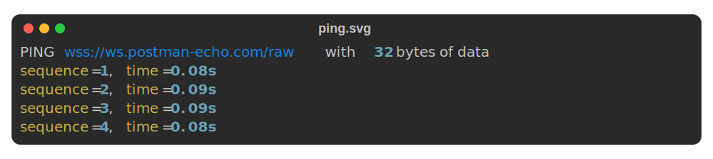

## ping

This command lets you PING a websocket server to check if it is still alive.

```shell
$ ws ping -h
Usage: ws ping [OPTIONS] URL

  Pings a websocket server located at URL.

Options:
  -m, --message BYTES         Message to send in the ping, MUST NOT be more
                              than 125 bytes.
  -n, --number INTEGER        Number of pings to make, a negative value means
                              infinite.  [default: 1]
  -i, --interval FLOAT RANGE  Interval between pings in seconds.  [default:
                              1.0; x>0]
  -d, --duration FLOAT RANGE  Time to run the program in seconds.  [x>0]
  -f, --file FILE             File to store the output. The file extension
                              determines the type of file will be created. A
                              file ending with ".html" will be an html file, a
                              file ending with ".svg" will be an SVG file and
                              other extensions will be considered as text
                              files.
  -h, --help                  Show this message and exit.
```

### Example usage

The basic example is at follows:

```shell
$ ws ping wss://ws.postman-echo.com/raw
PING wss://ws.postman-echo.com/raw with 32 bytes of data
sequence=1, time=0.08s
```

!!! note
    You can specify the response time for a ping using setting `response_timeout`. For more information on how to
    configure it, look at the [settings](../settings.md) documentation.

You can send multiple pings in a row using the `-n` option.

```shell
$ ws ping wss://ws.postman-echo.com/raw -n 4
PING wss://ws.postman-echo.com/raw with 32 bytes of data
sequence=1, time=0.08s
sequence=2, time=0.09s
sequence=3, time=0.08s
sequence=4, time=0.09s
```

When sending ping with no payload, a default one is created by
[trio_websocket](https://trio-websocket.readthedocs.io/en/stable/) which has a length of **32 bytes**. This is why you
see an output of the form `PING .. with 32..`. You can send a message with your ping, just make sure it is not more
than **125 bytes**. I say **bytes** instead of **characters** because there are many characters taking more than one
byte.

Here is an example sending the message "hello from Cameroon".

```shell
$ ws ping wss://ws.postman-echo.com/raw -m "hello from Cameroon"
PING wss://ws.postman-echo.com/raw with 19 bytes of data
sequence=1, time=0.08s
```

By default, the interval between pings is **1s**, but you can change it with `-i` option.

```shell
ws ping wss://ws.postman-echo.com/raw -n 4 -i 2
```

You can run the program for a specified time in seconds using the `-d` option.

```shell
$ ws ping wss://ws.postman-echo.com/raw -d 4
PING wss://ws.postman-echo.com/raw with 32 bytes of data
sequence=1, time=0.08s
```

**But, wait a minute!** Why I have only one ping? If you ask this question after trying the previous command, then it
is good (at least you tried) 😁. The issue here is that the default number of pings is **one**, so if you want to send
multiple pings without restrictions, give this option a negative value. It means *infinite*.

```shell
$ ws ping wss://ws.postman-echo.com/raw -d 4 -n -1
PING wss://ws.postman-echo.com/raw with 32 bytes of data
sequence=1, time=0.08s
sequence=2, time=0.09s
sequence=3, time=0.08s
sequence=4, time=0.09s
```

Now we have four pings which is normal since the default interval between pings is **1s**. The reason I don't change
the default number of pings to **infinite** when using the `-d` option is to give the possibility to users to have
a complex set up mixing interval time, and terminating the program whatever finishes first between the number of pings
or the specified time.

```shell
# guess what triggers the end of the program here? :)
$ ws ping wss://ws.postman-echo.com/raw -i 1.2 -n 20 -d 21
```

Last but not least, you can save terminal output in a file. There are three supported output formats:

- **html**: To save a file in html, the file you provide must end with the suffix `.html` like `file.html`.
- **svg**: To save a file in svg, the file you provide must end with the suffix `.svg` like `file.svg`.
- **plain text**: To save a file in plain text, it must end with a suffix different from the two listed above like
  `file.txt` or `file`.

```shell
$ ws ping wss://ws.postman-echo.com/raw -n 4 -f ping.svg
```

Here is what I got (ok it is small, but you got the idea 😛). 

!!! note
    You may want to adjust the terminal width before saving content to adjust the output size. Look at the
    [settings](../settings.md) documentation for details.

!!! note
    You can close the program ahead of time using `Ctrl+C`. On linux/unix systems you can use the `SIGTERM` signal to
    kill the process.

## pong

This command allows to send unsolicited pongs to a server and (maybe) see how it reacts to it.

```shell
Usage: ws pong [OPTIONS] URL

  Sends a pong to websocket server located at URL. This query does not wait
  for an answer.

Options:
  -m, --message BYTES         Message to send in the pong, MUST NOT be more
                              than 125 bytes.
  -n, --number INTEGER        Number of pongs to make, a negative value means
                              infinite.  [default: 1]
  -i, --interval FLOAT RANGE  Interval between pongs in seconds.  [default:
                              1.0; x>0]
  -d, --duration FLOAT RANGE  Time to run the program in seconds.  [x>0]
  -f, --file FILE             File to store the output. The file extension
                              determines the type of file will be created. A
                              file ending with ".html" will be an html file, a
                              file ending with ".svg" will be an SVG file and
                              other extensions will be considered as text
                              files.
  -h, --help                  Show this message and exit.
```

### Example usage

The basic usage is at follows:

```shell
$ ws pong wss://ws.postman-echo.com/raw
Sent unsolicited PONG of 0 byte of data to wss://ws.postman-echo.com/raw
sequence=1, time=0.00s
```

The usage is similar to the [ping](#ping) command so feel free to look at the previous section for the different
examples. I just want you to note two things:

- The time expressed in the output is the time taken to send the message, remember a pong frame is not expecting an
  answer. if you have no payload, it will probably be `0` all the time.
- By default, if no payload is provided to [trio_websocket](https://trio-websocket.readthedocs.io/en/stable/), it will
  send an empty pong. It is a different behaviour from what it does for a ping, I don't know why, but I don't try to
  interfere and forge a random payload 😬. So feel free to send a payload with your pong if you want one.
