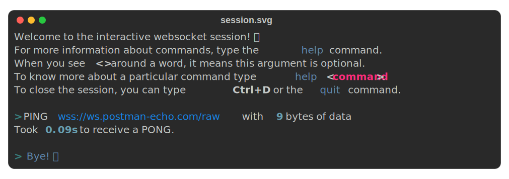

# session

This command regroups most of the commands used to interact to a websocket server namely [ping](ping_and_pong.md#ping),
[pong](ping_and_pong.md#pong), [text](text_and_byte.md#text) and [byte](text_and_byte.md#byte) plus methods to close
the connection, `close` and `quit`.
[Listen](listen_and_tail.md#listen) is not present since it does not allow further interaction with the server.

This command is useful if you want to interact with the server for a *long* time.

```shell
$ ws session -h
Usage: ws session [OPTIONS] URL

  Opens an interactive session to communicate with endpoint located at URL.

Options:
  -f, --file FILE  File to store the output. The file extension determines the
                   type of file will be created. A file ending with ".html"
                   will be an html file, a file ending with ".svg" will be an
                   SVG file and other extensions will be considered as text
                   files.
  -h, --help       Show this message and exit.
```

## Example usage

This command is well documented, so it should not be complicated to use it. Here is how you can discover subcommands and
get their documentation.

```shell
$ ws session wss://ws.postman-echo.com/raw
Welcome to the interactive websocket session! 🌟
For more information about commands, type the help command.
When you see <> around a word, it means this argument is optional.
To know more about a particular command type help <command>.
To close the session, you can type Ctrl+D or the quit command.

> help
The session program lets you interact with a websocket endpoint with the
following commands:

• ping <message>: Sends a ping with an optional message.
• pong <message>: Sends a pong with an optional message.
• text message: Sends text message.
• byte message: Sends byte message.
• close <code> <reason>: Closes the websocket connection with an optional code
and message.
• quit: equivalent to close 1000.

> help close
Closes the session given a code and an optional reason.

Example usage:

If no code is given, 1000 is considered as default meaning a normal closure.
Thus, it is equivalent to the quit command.

┌────────────────────────────────────────────────────────────────────────────┐
│ > close                                                                    │
└────────────────────────────────────────────────────────────────────────────┘

Closes the connection with a code 1001 and no message.

┌────────────────────────────────────────────────────────────────────────────┐
│ > close 1001                                                               │
└────────────────────────────────────────────────────────────────────────────┘

Closes the connection with a code 1003 and a message "received unknown data".

The message length must not be greater than 123 bytes.

┌────────────────────────────────────────────────────────────────────────────┐
│ > close 1003 'received unknown data'                                       │
└────────────────────────────────────────────────────────────────────────────┘

To know more about close codes, please refer to the RFC.
> quit
Bye! 👋
```

!!! note
    The `ping` and `pong` session subcommands do not support all the options the normal commands have. This is because
    I believe the `session` command is to test ideas quickly, which is not the case with these options.

You can save the output of the session in a file. There are three supported output formats:

- **html**: To save a file in html, the file you provide must end with the suffix `.html` like `file.html`.
- **svg**: To save a file in svg, the file you provide must end with the suffix `.svg` like `file.svg`.
- **plain text**: To save a file in plain text, it must end with a suffix different from the two listed above like
  `file.txt` or `file`.

The following example save the session output in an `svg` file.

```shell
$ ws session wss://ws.postman-echo.com/raw -f session.svg
```

Here is what I got from my session usage. 

!!! warning
    If you want to save output, bear in mind that it is saved in RAM memory, so you probably don't want to run the
    program for a **very long time** if you don't want to run out of memory.
